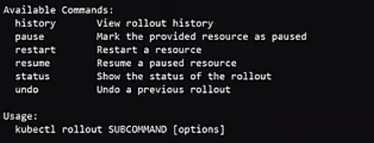

# Daily Notes

**Date : 25th Sept 2024;Day : Wednesday**

<mark style="color:red;">"&>":</mark> redirect Linux terminal standard output and standard error to the given file.                                                                   <mark style="color:red;">/dev/null</mark>: special file location in Linux. Any data sent here is discarded and it is always empty.                    1 is stdout. 2 is stderr. <mark style="color:red;">2>&1</mark> means redirecting stderr to stdout. <mark style="color:red;">2></mark> means "redirect standard-error" to the given file.

\_\_\_\_\_\_\_\_\_\_\_\_\_\_\_\_\_\_\_\_\_\_\_\_\_\_\_\_\_\_\_\_\_\_\_\_\_\_\_\_\_\_\_\_\_\_\_\_\_\_\_\_\_\_\_\_\_\_\_\_\_\_\_\_\_\_\_\_\_\_\_\_\_\_\_\_\_\_\_\_\_\_\_\_\_\_\_\_\_\_

HTTPS communication:

HTTP1 vs HTTP2 vs WebSockets.

Ephemeral Ports:  random high port used to communicate with a known server port.                    Temporary ports that are used for a short time to establish connections between a client and a server on the internet or a local network.

* How they workWhen a client initiates a connection, the operating system assigns it an ephemeral port number. This port acts as the client's identifier during the communication session.&#x20;
* How they are releasedOnce the communication session is complete, the ephemeral port is released and can be used again by other applications.&#x20;
* When they can failIf a device uses all of its available ports, it can experience port exhaustion, which can cause connections to fail.&#x20;
* How to change the ephemeral port rangeOn Linux, you can change the ephemeral port range by adding a line to a system startup script or by using the sysctl interface
* [https://blog.cloudflare.com/how-to-stop-running-out-of-ephemeral-ports-and-start-to-love-long-lived-connections/](https://blog.cloudflare.com/how-to-stop-running-out-of-ephemeral-ports-and-start-to-love-long-lived-connections/)
* [https://nginx.org/en/docs/http/websocket.html](https://nginx.org/en/docs/http/websocket.html)
* [https://www.whizlabs.com/blog/ephemeral-ports/](https://www.whizlabs.com/blog/ephemeral-ports/)
* [https://idea.popcount.org/2014-04-03-bind-before-connect/](https://idea.popcount.org/2014-04-03-bind-before-connect/)
* [https://unix.stackexchange.com/questions/65475/ephemeral-port-what-is-it-and-what-does-it-do](https://unix.stackexchange.com/questions/65475/ephemeral-port-what-is-it-and-what-does-it-do)
* [https://remy-nts.medium.com/aws-nacl-why-the-need-to-set-ephemeral-ports-range-for-outbound-rules-50ee93986555](https://remy-nts.medium.com/aws-nacl-why-the-need-to-set-ephemeral-ports-range-for-outbound-rules-50ee93986555)

Half vs full duplex communication: [https://www.cbtnuggets.com/blog/communication/half-duplex-vs-full-duplex](https://www.cbtnuggets.com/blog/communication/half-duplex-vs-full-duplex)

\--------------------------------------------------------------------------------------------------------------------

<mark style="color:red;">**ingress vs egress:**</mark> Ingress refers to the traffic coming into a network boundary, while egress refers to the traffic leaving the network boundary. An easy way to remember the distinction is to look at the prefix. Ingress is the traffic coming into, while egress is the traffic exiting. Another easy analogy is the difference between immigration and emigration.

\---------------------------------------------------------------------------------------------------------------------

What are Ingress, and Ingress controllers for K8?


\---------------------------------------------------------------------------------------------------------------------

Differences between Ingress Controller & Load Balancer?               [https://baeldung.com/ops/kubernetes-ingress-vs-load-balancer](https://baeldung.com/ops/kubernetes-ingress-vs-load-balancer)

Both direct the incoming traffic to k8 service. The main difference is that the Ingres controller directs the incoming external traffic/requests to different services within the cluster. In contrast, the load balancer only directs the incoming request to a particular Kubernetes service. Load Balancers works as reverse proxy.

Ingress Controller is within the Kubernetes cluster whereas load balances exists outside.

LB will also cost more.&#x20;

Azure Application Gateway Ingress Controller: [https://learn.microsoft.com/en-us/azure/application-gateway/ingress-controller-overview](https://learn.microsoft.com/en-us/azure/application-gateway/ingress-controller-overview)

\---------------------------------------------------------------------------------------------------------------------

<mark style="color:red;">**Forward Proxy vs Reverse Proxy.**</mark>                                                                                                                                                 Client side is the request initiator . Load Balancer works as a reverse proxy.                                                  A reverse proxy is a machine/service that sits in front of server side and forwards client-side requests to the application servers.

Opposite to that, a proxy server is a machine that sits in front of client-side machines, and forwards/communicates the incoming client requests to the the application servers.

<div align="left"><figure><figcaption></figcaption></figure></div>

* [https://www.cloudflare.com/learning/cdn/glossary/reverse-proxy](https://www.cloudflare.com/learning/cdn/glossary/reverse-proxy/)
* [https://www.youtube.com/watch?v=4NB0NDtOwIQ](https://www.youtube.com/watch?v=4NB0NDtOwIQ)

Layer4 vs Layer7 Load balancer.

Application LB vs Network LB.


\####################################################################

**Date : 27th Sept 2024;Day : Friday**

1. <mark style="color:red;">**SSL /TLS and HTTPS**</mark>**:**                                                                                                                                                      SSL (Secure Sockets Layer) and TLS (Transport Layer Security) are **security communication protocols** that encrypt data sent over the internet. SSL older technology establishes a secure connection between two devices or applications on a network using some encryption algorithm. SSL is commonly used to secure communication between a web browser and a web server, which **turns a website's address from HTTP to HTTPS.** **TLS** An upgraded version of SSL, TLS is the direct successor to SSL that fixes existing security flaws and authenticates more efficiently, and secures HTTPS. SSL's handshake process is completed in two steps, while TLS's handshake process is completed in one step.    &#x20;
   1. AWS: [https://aws.amazon.com/what-is/ssl-certificate](https://aws.amazon.com/what-is/ssl-certificate/)[https://aws.amazon.com/compare/the-difference-between-ssl-and-tls/](https://aws.amazon.com/compare/the-difference-between-ssl-and-tls/)
   2. ByteByteGo: [https://www.youtube.com/watch?v=j9QmMEWmcfo](https://www.youtube.com/watch?v=j9QmMEWmcfo), [https://www.youtube.com/watch?v=AlkDbnbv7dk\&t=72s](https://www.youtube.com/watch?v=AlkDbnbv7dk\&t=72s)
   3. kubeCation: [https://www.youtube.com/watch?v=T4Df5\_cojAs](https://www.youtube.com/watch?v=T4Df5_cojAs)
   4. Cloudflare: [https://www.cloudflare.com/learning/ssl/what-is-ssl/](https://www.cloudflare.com/learning/ssl/what-is-ssl/)
   5. Hussein: TLS:[https://www.youtube.com/watch?v=AlE5X1NlHgg](https://www.youtube.com/watch?v=AlE5X1NlHgg)
   6. Computerphile: [https://www.youtube.com/watch?v=0TLDTodL7Lc](https://www.youtube.com/watch?v=0TLDTodL7Lc)
   7. TLS Handshake(Compuetrphile): [https://www.youtube.com/watch?v=86cQJ0MMses](https://www.youtube.com/watch?v=86cQJ0MMses)
   8. Diff b/w httpd sessions key ID and php session IDs with CSRF[https://claude.ai/chat/0b452b75-3195-4edb-ba5f-9f33191bcae8](https://claude.ai/chat/0b452b75-3195-4edb-ba5f-9f33191bcae8)
2. <mark style="color:red;">**mTLS**</mark>:&#x20;
3. Cookies vs Session vs Tokens: [https://www.youtube.com/watch?v=GhrvZ5nUWNg\&t=125s](https://www.youtube.com/watch?v=GhrvZ5nUWNg\&t=125s)
4.  <mark style="color:red;">**TLS Termination**</mark><mark style="color:red;">:</mark> TLS Termination is a critical feature of any layer 7 proxy. AWS Application load balancer and Azure Application Gateway which are layer 7 load balancer supports it.                                            It brings SSL/TLS support to your applications by performing all encryption and decryption at the load balancer. The load balancer removes the encryption before passing the messages to your servers.                                                                                                                                                                    It's a process in which an LB talks and checks with the client for SSL verification and sorts it out at their end so that the server doesn't have to take the burden of SSL verification ie encrypting and decrypting the traffic.

    1. Generally, layer 4 LB does not have this capability of TLS termination on their part.  But AWS NLB offers this capability.
    2. Hussein: [https://www.youtube.com/watch?v=H0bkLsUe3no](https://www.youtube.com/watch?v=H0bkLsUe3no)
    3. [https://aws.amazon.com/blogs/aws/new-tls-termination-for-network-load-balancers/](https://aws.amazon.com/blogs/aws/new-tls-termination-for-network-load-balancers/)


5. <mark style="color:yellow;">Why only Layer 7 LB allows TLS termination and not Layer 4 LB?</mark>
6. <mark style="color:yellow;">How is Layer 4 AWS Network Load Balancer allowed to do TLS Termination?</mark>                                                                          AWS: [https://aws.amazon.com/blogs/aws/new-tls-termination-for-network-load-balancers/](https://aws.amazon.com/blogs/aws/new-tls-termination-for-network-load-balancers/)                                                 Hussein: [https://www.youtube.com/watch?v=ylkAc9wmKhc](https://www.youtube.com/watch?v=ylkAc9wmKhc) (Layer 4 vs Layer 7 Proxying)                                 Wikipedia: [https://en.wikipedia.org/wiki/TLS\_termination\_proxy](https://en.wikipedia.org/wiki/TLS_termination_proxy)                                                   [https://kubernetes-sigs.github.io/aws-load-balancer-controller/v2.4/guide/use\_cases/nlb\_tls\_termination/](https://kubernetes-sigs.github.io/aws-load-balancer-controller/v2.4/guide/use_cases/nlb_tls_termination/)                 [https://aws.amazon.com/blogs/networking-and-content-delivery/using-aws-lambda-to-enable-static-ip-addresses-for-application-load-balancers/](https://aws.amazon.com/blogs/networking-and-content-delivery/using-aws-lambda-to-enable-static-ip-addresses-for-application-load-balancers/)
7. <mark style="color:yellow;">Why AWS ALB can not get static Private IP whereas AWS NLB gets a static Private IP?</mark>

<figure><figcaption></figcaption></figure>

<figure><figcaption></figcaption></figure>

7. AWS ALB vs NLB: ALB uses NAT for reverse proxying traffic, whereas NAT ALB forwards the traffic using routes. NLB can have a static IP address. You can assign one Elastic IP address per availability zone but this this is impossible in AWS ALB. Application Load Balancers scale automatically to adapt to changes in your traffic. This makes planning for growth easy, but it has the side effect of changing the IP addresses that clients connect to.
   1. [https://shlomoswidler.com/2009/07/elastic-in-elastic-load-balancing-elb/](https://shlomoswidler.com/2009/07/elastic-in-elastic-load-balancing-elb/)
   2. [https://aws.amazon.com/de/blogs/aws/new-network-load-balancer-effortless-scaling-to-millions-of-requests-per-second/](https://aws.amazon.com/de/blogs/aws/new-network-load-balancer-effortless-scaling-to-millions-of-requests-per-second/)
   3. [https://aws.amazon.com/blogs/networking-and-content-delivery/using-aws-lambda-to-enable-static-ip-addresses-for-application-load-balancers/](https://aws.amazon.com/blogs/networking-and-content-delivery/using-aws-lambda-to-enable-static-ip-addresses-for-application-load-balancers/)


\####################################################################

**Date : 30th Sept 2024; Day : Monday**

1. WebSockets: What are they and why are they required/invented, like what problem statement do they solve? How to create one in Python.
   1. [https://www.fullstackpython.com/](https://www.fullstackpython.com/)
   2. [https://www.lancaster.ac.uk/staff/drummonn/PHYS281/demo-data-types/](https://www.lancaster.ac.uk/staff/drummonn/PHYS281/demo-data-types/)


1. **Kubernetes:**&#x20;
   1. Anthony:[**https://www.youtube.com/watch?v=6IPu3WU\_M0o\&list=PLiMWaCMwGJXnHmccp2xlBENZ1xr4FpjXF**](https://www.youtube.com/watch?v=6IPu3WU_M0o\&list=PLiMWaCMwGJXnHmccp2xlBENZ1xr4FpjXF)
   2. Pavan:[https://www.youtube.com/watch?v=YHuZ78Ig\_oc\&list=PLrMP04WSdCjrkNYSFvFeiHrfpsSVDFMDR](https://www.youtube.com/watch?v=YHuZ78Ig_oc\&list=PLrMP04WSdCjrkNYSFvFeiHrfpsSVDFMDR)


2. Kubernetes Ingres and Ingress Controller:


1. Symmetric vs Asymetric Encryption(Private Key vs Public key encryption):
   1. [https://www.ibm.com/docs/en/integration-bus/10.0?topic=overview-public-key-cryptography](https://www.ibm.com/docs/en/integration-bus/10.0?topic=overview-public-key-cryptography)

\_\_\_\_\_\_\_\_\_\_\_\_\_\_\_\_\_\_\_\_\_\_\_\_\_\_\_\_\_\_\_\_\_\_\_\_\_\_\_\_\_\_\_\_\_\_\_\_\_\_\_\_\_\_\_\_\_\_\_\_\_\_\_\_\_\_\_\_\_\_\_\_\_\_\_\_\_\_\_\_\_

<mark style="color:red;">**Internet Gateway(Router) vs NAT Gateway(NAT)**</mark>

In AWS, a **public subnet** is one in which there is a route in its route table for the outgoing internet traffic to the internet gateway to traffic to reach the internet.                                                                                                   &#x20;

> An Internet Gateway is a logical connection between a VPC and the Internet. If there is no Internet Gateway, then there is no connection between the VPC and the Internet.
>
> Every Amazon EC2 instance in a VPC has a private IP address. They can optionally also have a public IP address. This can either be a random one assigned when an instance is started, or a static Elastic IP address can be assigned to the instance.
>
> Actually, these public IP addresses are assigned to an Elastic Network Interface (ENI). An instance can have multiple ENIs.
>
> The instance itself doesn't actually 'know' that it has a public IP address / Elastic IP address. Instead, when traffic comes from the Internet destined for the public IP address, the Internet Gateway performs a reverse NAT and sends the traffic to the private IP address of the instance. Similarly, any traffic going from the instance to the Internet Gateway comes from the private IP address of the instance, which the Internet Gateway then forwards as coming from the instance's public IP address.
>
> Thus, the Internet Gateway 'owns' the public IP address, but forwards it to the instance. It's all quite magical, so sometimes it's just easier to imagine as the instance having the public IP address.
>
> One benefit of this method is that an Elastic IP address can be reassigned to another instance and traffic will immediately flow to the new instance without any configuration changes on the 'old' or 'new' instance. They just get traffic via their private IP addresses without knowing that a public IP address was involved.


The Internet gateway is a gateway to the Internet. It does not have its own Public IP. In the case of **public instance**s, i.e. the instances that are launched in a public subnet, and have a public IP assigned to them, the internet gateway maintains a one-on-one record/mapping in its database for these instances. When any internet traffic comes to them, they just do the one-on-one mapping from, for instance private IP address which is attached to its elastic network interface(ENI) to the public IP address from its mapping database and forward that traffic the the internet


> No, an EC2 instance in a public subnet without a public IP address will not be able to ping Google or access the internet outside of its virtual private cloud (VPC). This is true even if the instance has an internet gateway. To enable an EC2 instance in a public subnet to access the internet, the instance must have a public IPv4 or IPv6 address. You can also ensure that your security groups and network access control lists allow the desired internet traffic to flow to and from your instances

* [https://serverfault.com/questions/959750/aws-vpc-internet-gateway-vs-nat](https://serverfault.com/questions/959750/aws-vpc-internet-gateway-vs-nat)
* [https://serverfault.com/questions/948018/aws-nat-vs-aws-igw-vs-aws-router](https://serverfault.com/questions/948018/aws-nat-vs-aws-igw-vs-aws-router)
* AWS: Why does an Internet Gateway perform NAT: [https://stackoverflow.com/questions/49166308/aws-why-does-an-internet-gateway-perform-nat](https://stackoverflow.com/questions/49166308/aws-why-does-an-internet-gateway-perform-nat)
* Configuration for internet access: [https://docs.aws.amazon.com/vpc/latest/userguide/vpc-igw-internet-access.html#ip-addresses-and-nat](https://docs.aws.amazon.com/vpc/latest/userguide/vpc-igw-internet-access.html#ip-addresses-and-nat)
* NAT Gateway: [https://docs.aws.amazon.com/vpc/latest/userguide/vpc-nat-gateway.html](https://docs.aws.amazon.com/vpc/latest/userguide/vpc-nat-gateway.html)
* AWS: NAT Gateway in public subnet. Why: [https://serverfault.com/questions/854475/aws-nat-gateway-in-public-subnet-why](https://serverfault.com/questions/854475/aws-nat-gateway-in-public-subnet-why)
* Calude Chat: [https://claude.ai/chat/74b24014-d548-4fdc-b753-24e91b5e44a5](https://claude.ai/chat/74b24014-d548-4fdc-b753-24e91b5e44a5)


\_\_\_\_\_\_\_\_\_\_\_\_\_\_\_\_\_\_\_\_\_\_\_\_\_\_\_\_\_\_\_\_\_\_\_\_\_\_\_\_\_\_\_\_\_\_\_\_\_\_\_\_\_\_\_\_\_\_\_\_\_\_\_\_\_\_\_\_\_\_\_\_\_\_\_\_\_\_

<mark style="color:red;">**Stateful vs Stateless traffic:**</mark>

[https://www.techtarget.com/searchnetworking/answer/What-does-stateful-vs-stateless-mean-in-a-networking-context](https://www.techtarget.com/searchnetworking/answer/What-does-stateful-vs-stateless-mean-in-a-networking-context)

> Stateful traffic Stateful firewalls track the state of active connections, such as whether a packet is part of an existing conversation. They can inspect incoming traffic at multiple layers of the network stack, and compare inbound and outbound packets to assess communication attempts. Stateful firewalls are more secure and offer more flexible traffic control, but they require more processing power and memory.&#x20;
>
> Stateless traffic Stateless firewalls filter traffic based on predefined rules, without maintaining any knowledge of previous connections or sessions. They inspect each packet individually, based on criteria such as source and destination IP addresses, port numbers, and protocols. Stateless firewalls are faster but less secure than stateful firewalls, and they are easier to configure and less resource-intensive.


<mark style="color:red;">**Stateful vs Stateless Application:**</mark>

[https://www.baeldung.com/ops/kubernetes-deployment-vs-statefulsets](https://www.baeldung.com/ops/kubernetes-deployment-vs-statefulsets)


\_\_\_\_\_\_\_\_\_\_\_\_\_\_\_\_\_\_\_\_\_\_\_\_\_\_\_\_\_\_\_\_\_\_\_\_\_\_\_\_\_\_\_\_\_\_\_\_\_\_\_\_\_\_\_\_\_\_\_\_\_\_\_\_\_\_\_\_\_\_\_\_\_\_\_\_\_\_\_\_\_\_\_\_\_\_

<mark style="color:red;">**VPC Endpoints:**</mark>



<mark style="color:red;">**Gateway Endpoint vs Interface Endpoint:**</mark>

1. why-are-s3-gateway-endpoints-free: [https://stackoverflow.com/questions/75010572/why-are-s3-gateway-endpoints-free](https://stackoverflow.com/questions/75010572/why-are-s3-gateway-endpoints-free)
2. [https://docs.aws.amazon.com/vpc/latest/privatelink/vpc-endpoints-s3.html](https://docs.aws.amazon.com/vpc/latest/privatelink/vpc-endpoints-s3.html)

> A gateway endpoint is available only in the Region where you created it. Be sure to create your gateway endpoint in the same Region as your S3 buckets.
>
> When your instances access Amazon S3 or DynamoDB through a gateway endpoint, they access the service using its public endpoint. The security groups for these instances must allow traffic to and from the service. especially in SG outgoing rule.
>
> The network ACLs for the subnets for these instances must also allow traffic to and from the service. You can't reference prefix lists in network ACL rules, but you can get the IP address ranges for the service from its prefix list.


<mark style="color:red;">**AWS PrivateLink:**</mark>



<mark style="color:red;">**Create a VPC S3 Gateway Endpoint**</mark>

> How does gateway endpoint keeps the traffic private ? does it create a tunneling to s3 or do it require that s3 traffic to go to internet?  Does Gateway endpoint uses internet gateway to interact with S3 and DynamoDB ?
>
>
>
> It uses AWS Private network or AWS PrivateLInk service. The VPC gateway endpoint does not go through an internet gateway because it can access S3 and DynamoDB even in a VPC without an internet gateway.
>
> [https://repost.aws/questions/QUT5aA9H4oSk-pHH\_wv7bHPQ/does-gateway-endpoint-uses-internet-gateway-to-interact-with-s3-and-dynamodb](https://repost.aws/questions/QUT5aA9H4oSk-pHH_wv7bHPQ/does-gateway-endpoint-uses-internet-gateway-to-interact-with-s3-and-dynamodb)

<details>

<summary>Configure my Amazon VPC to privately connect to my S3 bucket</summary>

AWS KnowledgeCenter: [https://repost.aws/knowledge-center/s3-private-connection-no-authentication](https://repost.aws/knowledge-center/s3-private-connection-no-authentication)

[https://www.reddit.com/r/aws/comments/17aqo3s/vpc\_endpoints\_and\_how\_to\_configure\_them/](https://www.reddit.com/r/aws/comments/17aqo3s/vpc_endpoints_and_how_to_configure_them/)

</details>


> When your instances access Amazon S3 or DynamoDB through a gateway endpoint, they access the service using its public endpoint.
>
> Yes, becaue S3 and dynamodb are both global services, and they provide public endpoint to connect to them for global reach and availability.

[https://aws.amazon.com/blogs/security/how-to-connect-to-aws-secrets-manager-service-within-a-virtual-private-cloud/](https://aws.amazon.com/blogs/security/how-to-connect-to-aws-secrets-manager-service-within-a-virtual-private-cloud/)


Why gateway endpoint in first place anyway: [https://www.reddit.com/r/aws/comments/1bztaso/gateway\_endpoints\_reason/](https://www.reddit.com/r/aws/comments/1bztaso/gateway_endpoints_reason/)

Claude Chat: [https://claude.ai/chat/75f0e3ac-ad30-4320-baa3-95b8449c4bba](https://claude.ai/chat/75f0e3ac-ad30-4320-baa3-95b8449c4bba)t

ChatGPT Chat: [https://chatgpt.com/c/670ac7be-c5e0-8009-a6b2-352b5af6a0b3](https://chatgpt.com/c/670ac7be-c5e0-8009-a6b2-352b5af6a0b3)


\_\_\_\_\_\_\_\_\_\_\_\_\_\_\_\_\_\_\_\_\_\_\_\_\_\_\_\_\_\_\_\_\_\_\_\_\_\_\_\_\_\_\_\_\_\_\_\_\_\_\_\_\_\_\_\_\_\_\_\_\_\_\_\_\_\_\_\_\_\_\_\_\_\_\_\_\_\_\_\_\_\_\_\_

Redirection in HTTPD:

```
RewriteEngine On
RewriteRule ^$ /de [R=301,L]

sudo a2enmod rewrite
sudo systemctl restart httpd
```


ChatGPT: [https://chatgpt.com/c/671a879f-1af8-8009-ace1-1f03e3108e63](https://chatgpt.com/c/671a879f-1af8-8009-ace1-1f03e3108e63)

[https://developer.mozilla.org/en-US/docs/Web/HTTP/Redirections](https://developer.mozilla.org/en-US/docs/Web/HTTP/Redirections)

[https://http.dev/redirects](https://http.dev/redirects)

<mark style="color:red;">**WebSockets:**</mark>

Single vs duplex Communications:

Stateless vs Statefull:&#x20;

> Stateful and stateless are terms used to describe the way data is handled in systems, applications, and network protocols:
>
> * **Stateful**Retains information about previous requests and user interactions, and carries that information over to the next session. Stateful systems are able to provide a more personalized user experience by using this information to optimize subsequent interactions. However, they require careful management of session data and state information.
> * **Stateless**Treats each request independently, and doesn't preserve data between sessions. Stateless systems rely on external entities like databases or cache to manage state. Stateless systems are generally more scalable and fault-tolerant than stateful systems.&#x20;
>
>
>
> &#x20;Some examples of stateful and stateless systems:&#x20;
>
> * **Security groups:** A virtual firewall in AWS that tracks the state of a connection and automatically allows the corresponding outgoing traffic flow when incoming traffic is allowed.&#x20;
> * **Network Access Control Lists (NACLs):** A stateless system in AWS that requires explicit rules to be defined for both incoming and outgoing traffic.
>
>


Why WebSockets:

What are WebSockets:


\_\_\_\_\_\_\_\_\_\_\_\_\_\_\_\_\_\_\_\_\_\_\_\_\_\_\_\_\_\_\_\_\_\_\_\_\_\_\_\_\_\_\_\_\_\_\_\_\_\_\_\_\_\_\_\_\_\_\_\_\_\_\_\_\_\_\_\_\_\_\_\_\_\_\_\_\_\_

Date:28 Oct 2024

URL Normalization: URL normalization modifies separators, encoded elements, and literal bytes in incoming URLs so that they conform to a consistent formatting standard. URI normalization is the process by which URIs are modified and standardized in a consistent manner. The goal of the normalization process is to transform a URI into a normalized URI so it is possible to determine if two syntactically different URIs may be equivalent.


* Cloudflare: [https://developers.cloudflare.com/rules/normalization/how-it-works](https://developers.cloudflare.com/rules/normalization/how-it-works/)
* ChatGPT: [https://chatgpt.com/share/671f8e6c-5288-8009-80ca-c1ee76b7cd28](https://chatgpt.com/share/671f8e6c-5288-8009-80ca-c1ee76b7cd28)
* Azure Front Door CDN: [https://learn.microsoft.com/en-us/answers/questions/1506505/azure-front-door-url-normalization](https://learn.microsoft.com/en-us/answers/questions/1506505/azure-front-door-url-normalization)

<div align="left" data-full-width="false"><figure><figcaption></figcaption></figure></div>

<div align="right" data-full-width="false"><figure><figcaption></figcaption></figure></div>


GitOPS:&#x20;

[https://www.redhat.com/en/topics/devops/what-is-gitops](https://www.redhat.com/en/topics/devops/what-is-gitops)

***

Date:17Dec2024

AZURE Multi SIte Hoisting using Azure Load Balancer:

> Application Gateway supports multi-site listeners, which can listen on a certain domain name and you can upload your certificates to each one of them. But the limit on the number of listeners is 100 as of now.
>
> All the domain names that you have, can be CNAMEd to Application Gateway's FQDN and based on the hostname, you can create rules to specific backends.


[https://learn.microsoft.com/en-us/azure/application-gateway/multiple-site-overview](https://learn.microsoft.com/en-us/azure/application-gateway/multiple-site-overview)

[https://learn.microsoft.com/en-us/azure/application-gateway/features](https://learn.microsoft.com/en-us/azure/application-gateway/features)

[https://learn.microsoft.com/en-us/azure/application-gateway/key-vault-certs](https://learn.microsoft.com/en-us/azure/application-gateway/key-vault-certs)

AZURE WAF:

[https://learn.microsoft.com/en-us/azure/web-application-firewall/overview](https://learn.microsoft.com/en-us/azure/web-application-firewall/overview)

[https://learn.microsoft.com/en-us/azure/web-application-firewall/ag/ag-overview](https://learn.microsoft.com/en-us/azure/web-application-firewall/ag/ag-overview)

[https://learn.microsoft.com/en-us/azure/web-application-firewall/cdn/cdn-overview](https://learn.microsoft.com/en-us/azure/web-application-firewall/cdn/cdn-overview)

[https://learn.microsoft.com/en-us/azure/web-application-firewall/ag/web-application-firewall-troubleshoot](https://learn.microsoft.com/en-us/azure/web-application-firewall/ag/web-application-firewall-troubleshoot)

[https://learn.microsoft.com/en-us/answers/questions/1179573/how-to-define-ip-whitelist-in-azure-application-ga](https://learn.microsoft.com/en-us/answers/questions/1179573/how-to-define-ip-whitelist-in-azure-application-ga)

AWS NLB in public subnets with EC2 in private subnets:

> Excellent Reads:&#x20;
>
> [https://aws.amazon.com/blogs/networking-and-content-delivery/application-load-balancer-type-target-group-for-network-load-balancer](https://aws.amazon.com/blogs/networking-and-content-delivery/application-load-balancer-type-target-group-for-network-load-balancer/)
>
> [https://blog.envoyproxy.io/introduction-to-modern-network-load-balancing-and-proxying-a57f6ff80236](https://blog.envoyproxy.io/introduction-to-modern-network-load-balancing-and-proxying-a57f6ff80236)


Excellent

[https://aws.amazon.com/blogs/aws/new-network-load-balancer-effortless-scaling-to-millions-of-requests-per-second/](https://aws.amazon.com/blogs/aws/new-network-load-balancer-effortless-scaling-to-millions-of-requests-per-second/)

[https://stackoverflow.com/questions/48782856/aws-nlb-in-public-subnets-with-ec2-in-private-subnets](https://stackoverflow.com/questions/48782856/aws-nlb-in-public-subnets-with-ec2-in-private-subnets)

[https://repost.aws/knowledge-center/public-load-balancer-private-ec2](https://repost.aws/knowledge-center/public-load-balancer-private-ec2)

[https://docs.aws.amazon.com/elasticloadbalancing/latest/network/target-group-register-targets.html](https://docs.aws.amazon.com/elasticloadbalancing/latest/network/target-group-register-targets.html)

[https://docs.aws.amazon.com/elasticloadbalancing/latest/network/create-network-load-balancer.html](https://docs.aws.amazon.com/elasticloadbalancing/latest/network/create-network-load-balancer.html)

How to check my nlb static public ip address:

> **As IP address are assigned to NIC, you need to find the LB NIC and check there.**
>
> To find the static IP address of an AWS Network Load Balancer (NLB), you can use the AWS Management Console or the AWS Command Line Interface (CLI). You can also use a tool like nslookup to resolve the DNS name to the static IP addresses. Using the AWS Management Console&#x20;
>
> 1. Open the Amazon Elastic Compute Cloud (Amazon EC2) console
> 2. Select Load Balancers under Load Balancing
> 3. Copy the name of the load balancer
> 4. Select Network Interfaces under Network & Security
>
>

[https://repost.aws/knowledge-center/elb-find-load-balancer-ip](https://repost.aws/knowledge-center/elb-find-load-balancer-ip)

Server Name Indication (SNI):

#### Server Name Indication (SNI)

#### What is Server Name Indication (SNI)?

Server Name Indication (SNI) is an extension to the Transport Layer Security (TLS) protocol. It enables a client to communicate the hostname it intends to connect with during the initial stages of the TLS handshake.

#### Why is SNI Required?

Traditionally, SSL/TLS connections were limited because they could only serve a single certificate per IP address. This limitation posed a challenge for hosting multiple secure websites on one server with a single IP address.

#### Problem Solved by SNI

SNI resolves the issue of serving multiple secure sites on a single IP address. By allowing the client to specify the hostname during the handshake, the server can present the appropriate SSL certificate associated with that particular hostname. This facilitates hosting multiple SSL-enabled domains on a single server, optimizing resource use and enhancing security.

#### How SNI Works in Detail

1. **Client Hello Message**: When a client initiates a TLS connection to a server, it sends a "Client Hello" message. This message includes supported cipher suites, encryption methods, and the SNI extension containing the hostname the client wishes to connect to.
2. **Server Hello Message**: Upon receiving the "Client Hello" message, the server examines the SNI field to determine the correct hostname. Based on the indicated hostname, the server selects an appropriate SSL certificate.
3. **Certificate Presentation**: The server then responds with a "Server Hello" message that includes the server's selected cipher suite and the digital certificate corresponding to the requested hostname.
4. **TLS Handshake Completion**: The client verifies the server's certificate to ensure it is valid and matches the hostname. Once verified, the client and server proceed with the TLS handshake process to establish a secure, encrypted connection.
5. **Secure Communication**: With successful completion of the handshake, the client and server can securely exchange information using the agreed-upon encryption standards. The use of SNI allows for efficient utilization of server resources by hosting multiple secured domains on the same IP address without the need for separate IPs for each domain.

#### How Clients Know About Hostnames

Before making a connection, clients typically discover the hostname they wish to connect to through DNS (Domain Name System) resolution. The DNS server translates the human-readable domain name into an IP address. While DNS does not inform clients about all hostnames on a server, it provides the specific address needed for the desired site. Additionally, clients rely on SNI to specify and identify the intended hostname once the connection handshake begins, allowing the server to select the correct certificate for the secure connection.

Server Name Indication (SNI) is an extension to the Transport Layer Security (TLS) protocol that allows a client to specify the hostname it is trying to connect to at the start of the handshake process. This is crucial when multiple secure (HTTPS) websites are hosted on the same IP address and port, enabling the server to select the correct digital certificate for the requested hostname. As a result, SNI allows for more effective use of server resources and improves the security and efficiency of the TLS protocol.


