# Page10: Kubernetes Services

**Why did we require** it? What problems were we facing before this, and how did it help us? \
And what are these?

**Why are services needed?**

1. How do pods communicate:  Through IP or DNS name
2. Pods are **ephemeral**. When they die, a new pod takes its place with a **new IP** address and a new name. If a deployment controller manages them, each pod will have a **random hash** appended to the name of the pod
3. So we cannot rely on the pod IP/DNS names, as they change whenever a pod dies, and a new one replaces it, with a completely new identity.
4. How do we **load balance** the incoming requests among various pod replicas? If there are 3 back-end pod replicas, how do we ensure requests are distributed to avoid overloading a single pod?
5. How to **expose the pods outside the cluster** to make the application available for public use?

<div><figure><figcaption></figcaption></figure> <figure><figcaption></figcaption></figure></div>

<figure>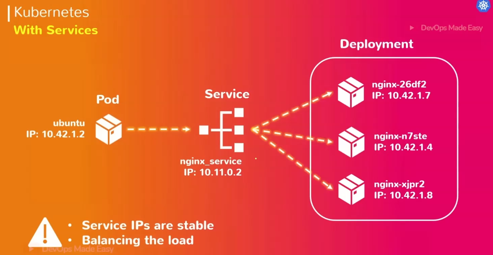<figcaption></figcaption></figure>

**What:** Services are not the running components, just like other objects, like pods. It is simply a logical configuration defined using template files.

* **Kubernetes Service** is an abstraction that defines a logical set of Pods running somewhere in your cluster, which all provide the same functionality
* Each Service is assigned a unique IP address at the time of creation.
* This address is tied to the lifespan of the Service, and will not change while the Service is alive.
* Pods can be configured to forward traffic to the Service, and the Service will automatically forward that traffic to any of its member pods in a load-balanced way
* Kubernetes Service provides the <mark style="color:$success;">IP Address,</mark> a single <mark style="color:$danger;">DNS name</mark>, and a <mark style="color:orange;">Load Balancer</mark> to a set of Pods
* <mark style="color:$info;">A Service identifies its member Pods with a</mark> <mark style="color:$info;"></mark><mark style="color:$info;">**selector**</mark><mark style="color:$info;">. For a Pod to be a member of the Service, the Pod must have all of the</mark> <mark style="color:$info;"></mark><mark style="color:$info;">**labels**</mark> <mark style="color:$info;"></mark><mark style="color:$info;">specified in the selector of the service</mark>
* A **label** is an arbitrary **key/value pair** that is attached to an object.
* Service automatically removes unhealthy pods from its load balancing.
*   **Services are namespaced objects in K8s:**&#x20;

    That means:

    * A Service exists **only within the namespace** it is created in.
    * If you create a Service called `my-service` in the `dev` namespace, it will not be visible in the `prod` namespace unless you explicitly expose it across namespaces.
    *   DNS names for services include the namespace:

        ```
        my-service.dev.svc.cluster.local
        ```

        Here:

        * `my-service` → Service name
        * `dev` → Namespace
        * `svc.cluster.local` → Kubernetes service domain

        <figure><figcaption></figcaption></figure>

    **Implication:**

    * A Pod in one namespace can’t access a Service in another namespace by just using its short name (`my-service`) — it must use the full DNS name or be given special network rules.
    * This helps with isolation between environments (e.g., dev, staging, prod).


<div><figure><figcaption></figcaption></figure> <figure><figcaption></figcaption></figure> <figure><figcaption></figcaption></figure></div>

Each of these Pods will have a label during its deployment. Service will use these labels to forward the traffic. So now, in case a new pod is being generated inside the same deployment, it will have a label attached to it, which will help the service to find these new pods and traffic the load to them.

**Service will have its unique IP Address.**  <mark style="background-color:$primary;">But PodA application talks to the service with the service name instead of its IP address</mark>, so even if we create a new service with the same name, it will get a new IP address, but it will work the same way as the old one if the configuration is are same. These service IP addresses are provided by the kube-api server.

ClusterIP:

<figure>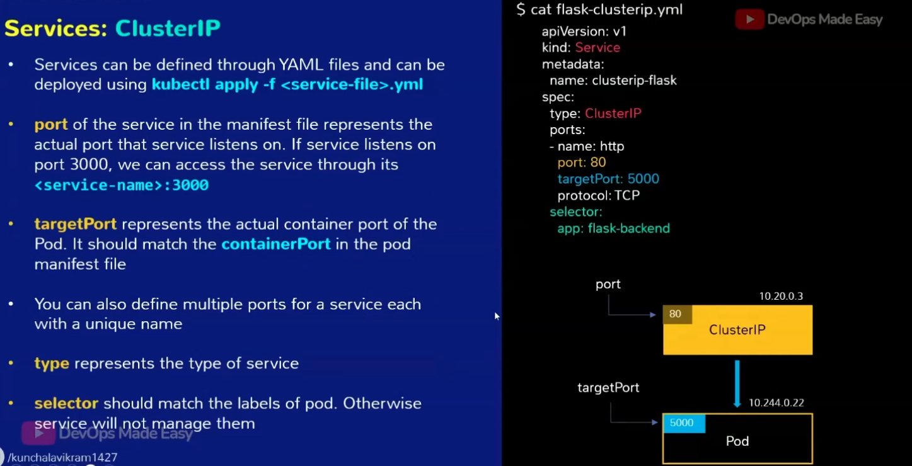<figcaption></figcaption></figure>

Service Discovery:

<figure><figcaption></figcaption></figure>

<figure>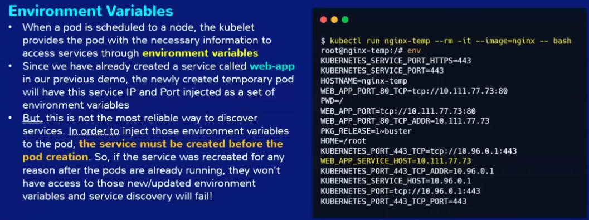<figcaption></figcaption></figure>

<figure><figcaption></figcaption></figure>

<figure>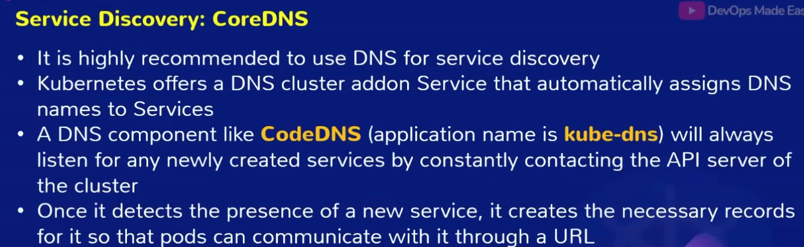<figcaption></figcaption></figure>

<figure><figcaption></figcaption></figure>

<figure><figcaption></figcaption></figure>

<figure>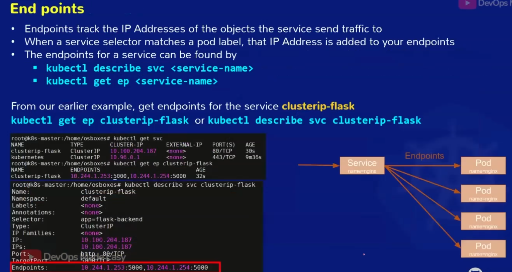<figcaption></figcaption></figure>

NodePort:

<figure>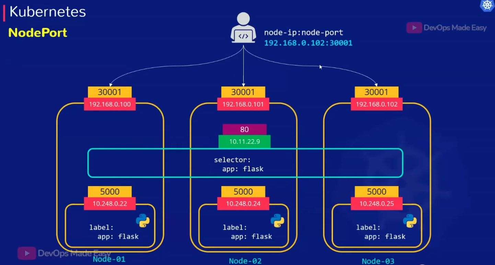<figcaption></figcaption></figure>

<figure>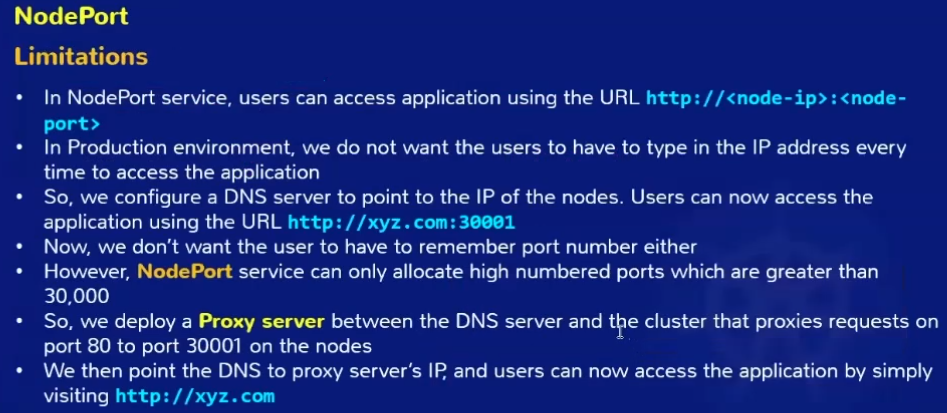<figcaption></figcaption></figure>

<figure>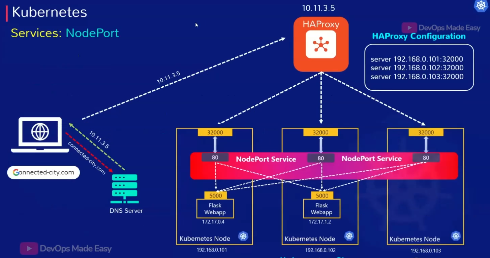<figcaption></figcaption></figure>

LoadBalancer:

<figure>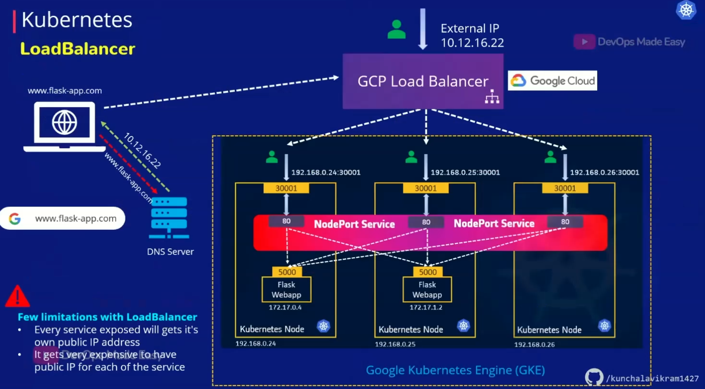<figcaption></figcaption></figure>

<figure><figcaption></figcaption></figure>

Headless:

<figure>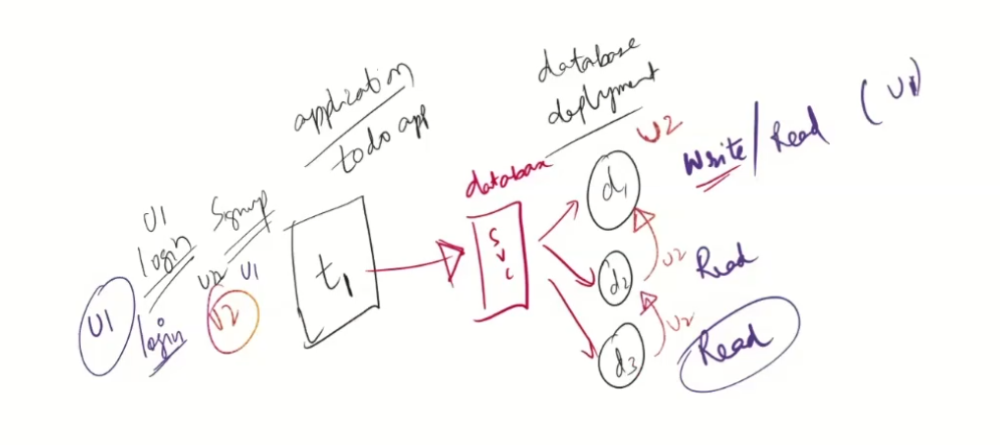<figcaption></figcaption></figure>

<figure>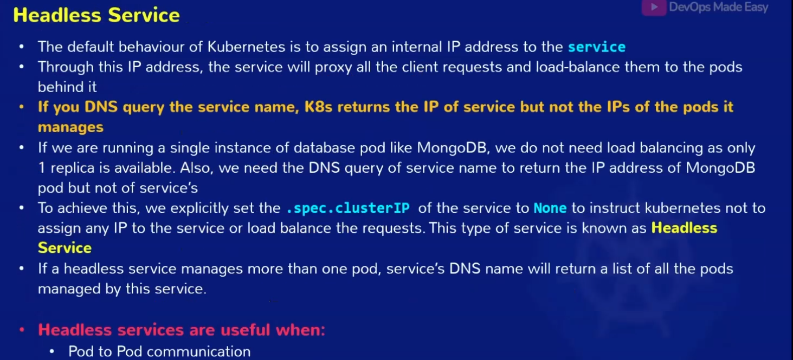<figcaption></figcaption></figure>

<figure>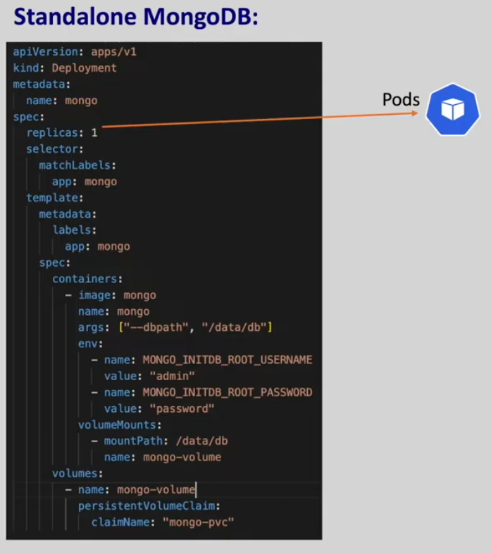<figcaption></figcaption></figure>

ExternalName: Service without any pod binding to it, unlike the  other three. Access objects outside of the cluster.\
Application needs to refer to external services outside the cluster.\
Services in one namespace need to access services in another namespace.


[https://iximiuz.com/en/categories/?category=Containers](https://iximiuz.com/en/categories/?category=Containers)

[https://www.boot.dev/lessons/662d61c6-ca8d-4b97-9dbe-55b8fa1c12a9](https://www.boot.dev/lessons/662d61c6-ca8d-4b97-9dbe-55b8fa1c12a9)
