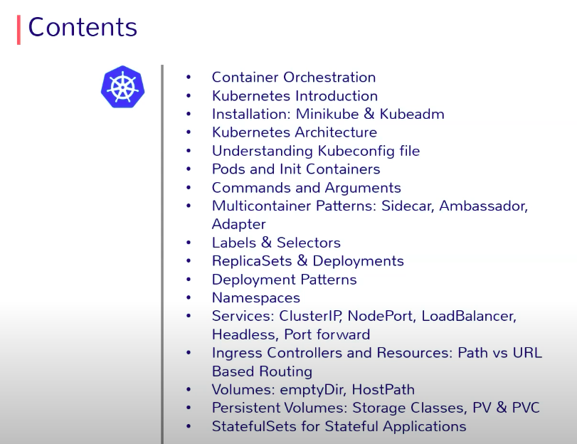

# Page5: Labels & Selectors

**Labels**: ( --label )

adds l**ogical metadata** to the Kubernetes objects like services, deployments, pods, etc, which can be used to group/organize objects/resources under a single identity depending upon the use-case/logic they implement and can be used later for **filtering** and finding specific objects.

Key Value pairs that can be added at creation time or later stages. Many objects can carry the same label(s).

<figure><figcaption></figcaption></figure>

**Using the Imperative way of creating labels:**

```
kubectl run nginx-pod --image=nginx -l "stage=dev,version='2.0'"

kubectl gets pods --show-labels
```

If no labels are being passed while deploying Kubernetes objects, a default label is always attached to the object. <mark style="color:green;">**run:\<object-name>**</mark>

```

kubectl run nginx-pod --image=nginx,

#This will have a label as "run=nginx-pod"

```

**Note:** use "--<mark style="color:green;">**overwrite**</mark>" for modifying the key value to some other value.

kubectl label pod label-demo  stage=prod --overwrite

To delete the label: kubectl label pod label-demo  stage-


**Annotations:**

They are also used for metadata for the Kubernetes objects. But these are non-identifying metadata, not used by K8, and cannot be used by selectors either. These are just **general, useful information** in case you want to put them into resource metadata to add more context to that resource.

The information on the annotations is not intended for querying and matching\
objects

```
kubectl annotate pod nginx owner=ankit

kubectl describe pods nginx
```

<figure><figcaption><p>means this app is exposing its metric on 9102 port on /metrics path</p></figcaption></figure>

UseCase: These annotations can be used by external apps/tools

Prometheus is running inside the cluster, and wants to monitor this pod, so it will need some configuration(what type of configuration?). In that case, we can either provide it conf file or we can add data to the pod itself using an annotation(why annotation only and not labels?)

means this app is exposing its metrics on 9102 port on /metrics path, which means that Prometheus running in another pod can access this pod's app metrics using IP/metrics:9102 port.

In this case, these keys are not random but very specific to the tools that will use them, **as these tools are expecting these keys to work**, like **prometheus.io/path** and **prometheus.io/port** are very specific keys for defining these values. Prometheus running inside your cluster will scan/read annotations for all pods, and if those specific annotations are there in the pods, it will automatically configure itself. Prometheus pod must have read access to all these PODS.


**Selectors:** &#x20;

1. Used to query and filter objects based on their labels. ( --selector )
2. **Targets** the K8 objects to a specific resource, like in the below case, if you want a pod to be launched on a specific node  which have a **label** "<mark style="color:green;">accelerator: nvidia-tesla-p100</mark>" with it.


* **Equality-based selectors:** Select objects that have a specific label key-value pair. Example: `app=nginx or tier != backend`. Operators ( = , !=   ). Used by Replication Controllers and Services.

<figure><figcaption></figcaption></figure>


* **Set-based selectors:** Allow for more complex selection criteria, such as selecting objects based on whether a label exists or if its **value is within a set of values.**                                                           Example: `environment in (production, qa)`.  Operators: in, notin, exists. Used in ReplicaSets, Deployments, DaemonSets.

<figure><figcaption><p>matchLabels and matchExpressions</p></figcaption></figure>

<mark style="color:red;">**Note**</mark>**:\*** Comma separator acts as <mark style="color:green;">**AND**</mark>**&#x20;operator.**

Common Use Cases:

1. **1. Services:** Services use selectors to identify the pods they should route traffic to. For example, a service might select all pods with the label `app: my-app`.
2. **2. Deployments:** Deployments use selectors to determine which pods they manage. A deployment might manage all pods with the label `tier: frontend`.
3. **3. ReplicaSets:** ReplicaSets use selectors to identify the pods they are responsible for managing.

```
kubectl get pods --selector name=my-app

#gets pods with only label key
kubectl get pods --selector "key"
kubctl get pods -l "! key"
```
