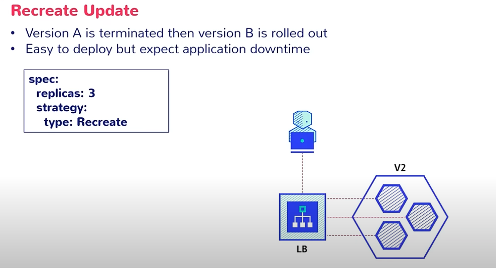
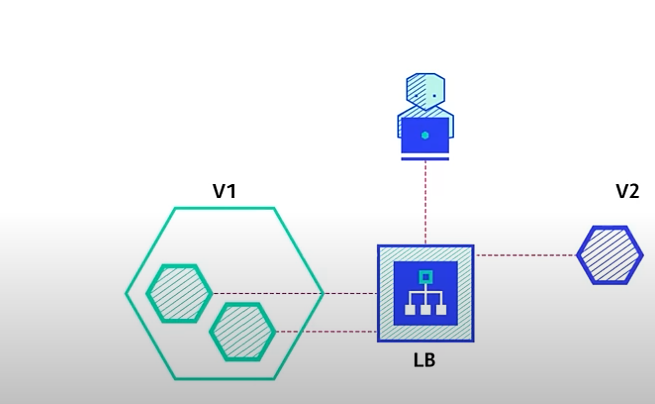
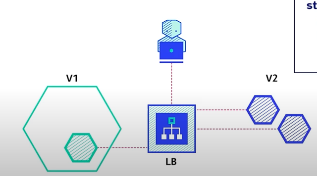
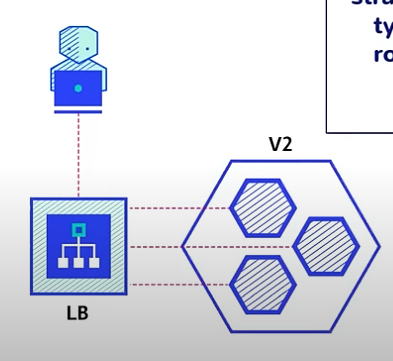
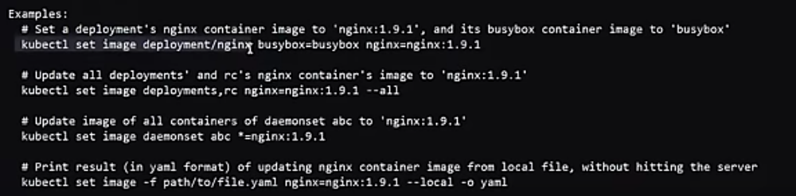

# Page8: Deployments

<figure><figcaption></figcaption></figure>

#### Rolling Updates:

Rolling updates are a **deployment strategy** where you **incrementally** replace instances of an old version of an application with new versions, rather than taking the entire system down at once.                                            Instead of stopping the entire system at once, rolling updates deploy the new version to a small subset of instances, test them, and then proceed with the rest of the instances.

**Basic Process:**

1. Deploy the new version to a subset of servers/instances
2. Route traffic away from old instances being updated
3. Replace old instances with new ones incrementally
4. Monitor health and performance at each step
5. Continue until all instances are updated

**Key Benefits:**

* **Zero downtime** - Users continue to access the service during updates
* **Resource efficiency** - Don't need double infrastructure capacity

<mark style="color:red;">K8 Deployments (Controller):</mark> [https://kubernetes.io/docs/concepts/workloads/controllers/deployment/](https://kubernetes.io/docs/concepts/workloads/controllers/deployment/)

Describes the number of desired identical pod replicas and the preferred update strategy to use when updating. Rolling update is its default strategy.&#x20;

Tracks PODS health and adds/removes pods as needed to bring deployment to the desired state.

**Deployment**

* **Deployment** owns and manages one or more **ReplicaSets,** and a ReplicaSet manages the **Pod** replicas
* Deployment manages multiple ReplicaSets to support the rollback mechanism
* Kubernetes creates a new ReplicaSet each time a new Deployment config is deployed and also keeps the old ReplicaSet, so we can rollback to the previous state with the old ReplicaSet
* Rolling updates, rollbacks, and pausing the deployment/updates are not possibkle in RC or ReplicaSets alone.&#x20;

**NOTE :\*** After the complete deployment, we will not see the old objects, but the configuration will be maintained in the deployment, so that we can revert back in case of rollback.

<figure><figcaption></figcaption></figure>

<mark style="color:red;">Release Update Strategies</mark>: A new deployment triggers a rollout/Release.

* Recreate: Not reco. Delete the old and release the new version. App downtime.
* Rolling/Ramped Update: Default rolling strategy.
* Blue/Green: Release a new version alongside the existing one, and then switch traffic.
* Canary: Release a new version to a subset of users, then roll it out to the full user base.
* A/B testing: release a new version to a subset of users in a more controlled way. Not out of the box with K8, requires Service mesh infra(Istio, Traefik, Nginx.haproxy etc)

[https://github.com/ContainerSolutions/k8s-deployment-strategies](https://github.com/ContainerSolutions/k8s-deployment-strategies)

Recreate:

<div><figure><figcaption></figcaption></figure> <figure><figcaption></figcaption></figure></div>

```
#
apiVersion: apps/v1
kind: Deployment

metadata:
  name:  recreate-deploy        #deployment-name
  namespace: default
  labels:
    app:  nginx

spec:
  replicas: 3

  selector:
    matchLabels:
      app: nginx
 
  strategy:
    rollingUpdate:
      maxSurge: 25%
      maxUnavailable: 25%
    type: RollingUpdate
    
  template:
    metadata:
      labels:
        app:  nginx
    spec:
      containers:
      - name: nginx
        image: nginx
        resources:
          limits:
            cpu: 200m
            memory: 500Mi
          requests:
            cpu: 100m
            memory: 200Mi
            
           ports:
        - containerPort: 80


kubectl apply -f deploy_recreate.yaml
kubectl get deploy
kubectl describe deploy <deployment-name>
kubectl edit deploy recreate-deploy
```

```

kubectl get pods                                                                                                                      
NAME                               READY   STATUS    RESTARTS   AGE
recreate-deploy-5945559446-5b8pg   1/1     Running   0          5m12s
recreate-deploy-5945559446-gjqt4   1/1     Running   0          5m12s
recreate-deploy-5945559446-wg78k   1/1     Running   0          5m12s

recreate-deploy is the deployment name, "5945559446" is the replica set ID


kubectl get rs                                                                                                                        
NAME                         DESIRED   CURRENT   READY   AGE
recreate-deploy-5945559446   3         3         3       9m42s

After changing my image from nginx to httpd:
kubectl apply -f deploy_recreate.yaml

kubectl get deploy                                                                                                                    󱃾 minikube root@HMECL-0173C0700 20:38:32
NAME              READY   UP-TO-DATE   AVAILABLE   AGE
recreate-deploy   5/5     5            5           17m

kubectl get rs                                                                                                                        󱃾 minikube root@HMECL-0173C0700 20:37:57
NAME                         DESIRED   CURRENT   READY   AGE
recreate-deploy-579fc46cb6   5         5         5       56s
recreate-deploy-5945559446   0         0         0       16m

# A separate replica set gets created, along with the older version,
#but it does not have any pods in it.

kubectl get pods                                                                                                               󱃾 minikube root@HMECL-0173C0700 20:37:54
NAME                               READY   STATUS    RESTARTS   AGE
recreate-deploy-579fc46cb6-2dvwr   1/1     Running   0          21s
recreate-deploy-579fc46cb6-7rv5f   1/1     Running   0          21s
recreate-deploy-579fc46cb6-7zmv6   1/1     Running   0          21s
recreate-deploy-579fc46cb6-mnmwb   1/1     Running   0          21s
recreate-deploy-579b6-phsjx   1/1     Running   0          21s

```

All pods are terminated at once, and all get created at once. Leading to downtime at each rollout.               Also, I noticed that when something goes wrong in rollout, the app goes down as it has already deleted all pods before starting new pods with diff version at the same time, leading to downtime.

**Rolling**:

<div><figure><figcaption></figcaption></figure> <figure><figcaption></figcaption></figure> <figure><figcaption></figcaption></figure> <figure><figcaption></figcaption></figure></div>

&#x20;<mark style="color:red;">The</mark> `maxUnavailable` <mark style="color:yellow;">setting determines how many pods can be unavailable during the update process, while</mark> `maxSurge` <mark style="color:yellow;">controlling how many additional pods can be created above your desired replica count. The default is</mark> <mark style="color:red;">25%</mark> <mark style="color:yellow;">if values are not provided, which means that only 25% of pods are unavailable during updates, and it does not update more than 25% of pods at a time.</mark>

It depends on what type of rolling strategy you want; you can go either way of first increasing the number of pods more than the desired pods, then deploying a new version in them, and then replacing the surge quantity from the old version. Or you can keep surge to 0, meaning that we do not want to increase pods more than the desired, but we can keep unavailable to a number other than 0, which will first delete that number of pods and then bring back pods with a newer version in the same number.

First, the maxSurge pod comes up. It does not kill old pods until new ones come up, and also, it does not add new pods until a certain number of pods are killed.

> <mark style="color:red;">**Note:**</mark>**&#x20;maxUnavailable cannot be 0, if maxSurge is set to 0. Other wise there will be no rollout as if both are 0.**
>
> If you set `maxSurge: 0`, then Kubernetes would have to terminate old pods first (up to `maxUnavailable`) before creating new ones, which could temporarily reduce your available capacity.

When both `maxUnavailable` and `maxSurge` are set to positive numbers, Kubernetes will **create new pods first** (using `maxSurge`) before terminating any old pods.

Here's exactly what happens:

**The Process with Both Parameters Set:**

1. **New pods are created first** - Kubernetes immediately starts creating new pods up to the `maxSurge` limit
2. **Wait for new pods to become ready** - The system waits for these new pods to <mark style="color:yellow;">pass their readiness probes</mark>
3. **Only then, terminate old pods** - Once new pods are ready and serving traffic, Kubernetes begins terminating old pods (respecting the `maxUnavailable` limit)

This approach prioritizes availability over resource efficiency. This approach is generally preferred for production environments where maintaining service availability is more important than temporarily using extra resources.

```

kubectl get pods                                                                                                                      
NAME                              READY   STATUS    RESTARTS   AGE
rolling-deploy-5945559446-44lvq   1/1     Running   0          18s
rolling-deploy-5945559446-9s2t5   1/1     Running   0          18s
rolling-deploy-5945559446-jbnxl   1/1     Running   0          18s
rolling-deploy-5945559446-kc4w4   1/1     Running   0          18s
rolling-deploy-5945559446-pfwww   1/1     Running   0          18s
```

<figure><figcaption></figcaption></figure>

```
// Some code
kubectl rollout -h    

kubectl rollout status deploy <deployment-name>
kubectl rollout history deploy <deployment-name>

# Check revision details 
kubectl rollout history deploy <deployment-name> --revision=4
    
#We can rollback to a specific revision:
kubectl rollout undo deploy <deployment-name> --to-revision=n

#set deployment image imperatively (without changing the manifest file)
kubectl set image deployment/<deployment-name> <container-name>=<image-name>

#scale up
kubectl scale deployment/<deployment-name> --replicas=10

#scale down
kubectl scale deployment/<deployment-name> --replicas=0
```

<div><figure><figcaption></figcaption></figure> <figure><figcaption></figcaption></figure></div>


Once rolling deployment is complete, 100% of traffic will be served by the updated application pods.

There is a case where, instead of serving 100%, we want to serve n% of users to the new app pods and the remaining to the old ones only, to load test the updated app. Require advanced configuration like Istio etc.

**Blue/Green deployment**:

**Release a new version(green) alongside the existing one, and then switch traffic.                                                     Instant Rollout, but at the expense of doubling resources.**

Once the testing is done on v2, we will shift the traffic to the new version and later delete the old deployment/resources. This traffic shift is not automatic; we need to make service configuration changes to make it once all things are tested.


**Canary deployment:** Requires Istio-like applications to implement.

<figure><figcaption></figcaption></figure>

Not Possible without Istio-like tools.

<figure><figcaption></figcaption></figure>


**Extra Read:**

K8 Rolling Deployment Process:

Here's the step-by-step process: First, Kubernetes creates new pods with your updated application image. It doesn't immediately destroy the old ones - instead, it waits for the new pods to become ready and pass their health checks. Only then does it begin terminating old pods, doing so gradually to ensure you always have enough healthy pods to serve traffic.


The health checks in this configuration are critical - they're what make rolling updates safe and reliable. Notice how we have both `livenessProbe` and `readinessProbe` configured. The readiness probe is particularly important during rolling updates because it tells Kubernetes when a new pod is ready to receive traffic.                                                                                                                                                             When Kubernetes creates a new pod with your updated code, it doesn't immediately start sending traffic to it. Instead, it waits for the readiness probe to succeed. Only when the probe returns a successful response does Kubernetes add the pod to the service's pool of healthy endpoints. This prevents users from hitting a pod that might still be initializing or might have issues with the new version.


**Triggering and Monitoring Rolling Updates**

You can trigger a rolling update in several ways. The most common is simply updating the image tag in your deployment specification and applying the changes. When you run `kubectl apply -f deployment.yaml`  After changing the image  `myapp:v1.0` to `myapp:v2.0`Kubernetes immediately begins the rolling update process.

You can also trigger updates directly from the command line using `kubectl set image deployment/webapp-deployment webapp=myapp:v2.0`. This is particularly useful in CI/CD pipelines where you might want to programmatically deploy new versions.


<pre class="language-bash"><code class="lang-bash">#Commands

kubectl set image deployment/webapp-deployment webapp=myapp:v2.0

kubectl rollout status deployment/webapp-deploy Butment

#Revert/Rollback
kubectl rollout undo deployment/webapp-deployment
<strong>
</strong>#Pause rolling update
kubectl rollout pause 
#useful if you want to observe how the first few updated pods are behaving before continuing


</code></pre>

We might implement blue-green deployments or canary releases, which build upon the rolling update foundation but add additional layers of safety and control.


Refs:

[https://kubernetes.io/docs/concepts/workloads/controllers/deployment/](https://kubernetes.io/docs/concepts/workloads/controllers/deployment/)

[https://github.com/ContainerSolutions/k8s-deployment-strategies](https://github.com/ContainerSolutions/k8s-deployment-strategies)

