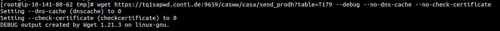
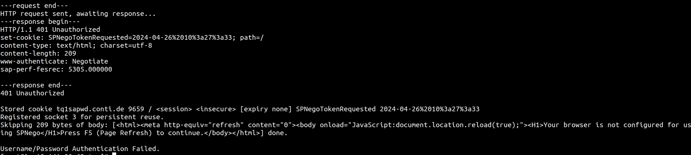

# SSLConnectionIssue\_CASA

Error: While trying to wget/curl client https API URL, request is able to resolve domain name to server and http connect to it using but was having issues while doing secure connection due to cert issues.

Solution:

First I tried telnet to url to check for connectivity and it was successful.

then i tried wget with “--no-dns-cache –no-check-certificate”

in that case, it goes forward , but gives 401 Unauthorized with SPNego error

\--no-dns-cache

Turn off caching of DNS lookups. Normally, Wget remembers the IP addresses it looked up from DNS so it doesn't have to repeatedly contact the DNS server for qthe same (typically small) set of hosts it retrieves from. This cache exists in memory only; a new Wget run will contact DNS again.

Reference Links:

[https://stackoverflow.com/questions/24611640/curl-60-ssl-certificate-problem-unable-to-get-local-issuer-certificate?page=1\&tab=scoredesc#tab-top](https://stackoverflow.com/questions/24611640/curl-60-ssl-certificate-problem-unable-to-get-local-issuer-certificate?page=1\&tab=scoredesc%22%20\l%20%22tab-top)

[https://stackoverflow.com/questions/71909552/still-same-error-display-curl-error-60-ssl-certificate-problem-unable-to-get](https://stackoverflow.com/questions/71909552/still-same-error-display-curl-error-60-ssl-certificate-problem-unable-to-get)
